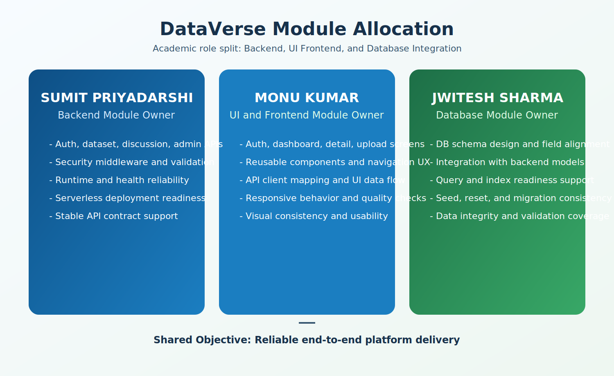

# DATAverse Team Module Report (Backend + UI + Database)

## Role Overview and Module Allocation

- Sumit Priyadarshi -> Backend
- Monu Kumar -> UI and Frontend
- Jwitesh Sharma -> Database and Integration

## Team Members and Ownership

- Sumit Priyadarshi: Project leader and backend development owner
- Monu Kumar: UI and frontend development owner
- Jwitesh Sharma: Database development and integration owner

## Report Objective

This document provides complete module-level contribution evidence for all three members of DATAverse. It includes backend, UI/frontend, and database responsibilities with file-level ownership.

## Module 1: Backend (Owner: Sumit Priyadarshi)

### Scope and Responsibilities

- Build and maintain a modular backend architecture for auth, datasets, discussions, and admin APIs
- Enforce JWT authentication, validation middleware, and authorization checks on protected workflows
- Maintain security controls across routes, inputs, and operational monitoring layers
- Support real-time communication flow through Socket.IO integration with core API services
- Ensure runtime reliability for local server and serverless deployments
- Maintain attachment upload integration and backend utility services

### Backend Files and Components

- backend/app.js
- backend/server.js
- backend/dev-server.js
- backend/index.js
- backend/health.js
- backend/routes/auth.js
- backend/routes/datasets.js
- backend/routes/discussions.js
- backend/routes/admin.js
- backend/middleware/auth.js
- backend/middleware/inputValidation.js
- backend/middleware/security.js
- backend/utils/db.js
- backend/utils/cache.js
- backend/utils/blobStorage.js
- backend/utils/datasetQuality.js
- backend/utils/mailer.js
- backend/utils/piiGuard.js
- backend/utils/securityEvents.js
- backend/api/index.js
- backend/api/health.js
- backend/api/_core.js
- backend/api/auth/[...auth].js
- backend/api/datasets/[...datasets].js
- backend/api/discussions/[...discussions].js
- backend/api/admin/[...admin].js

### Backend Outcomes

- Stable API contract delivery for frontend integration
- Secure route behavior with middleware enforcement
- Real-time backend communication support for live update scenarios
- Improved startup and fault-handling reliability
- Health endpoint support for deployment checks

## Module 2: UI and Frontend (Owner: Monu Kumar)

### Scope and Responsibilities

- Build and maintain user interface for authentication and dashboard workflows
- API Integration Layer: connect frontend with backend APIs using Axios for dynamic data communication
- Authentication Flow Handling: manage token handling, protected routes, and session continuity
- System Integration: ensure smooth frontend to backend communication, including Socket.IO real-time updates
- Testing and Validation: verify API behavior, integration flow, and error-handling reliability
- Maintain responsive design and user interaction quality
- Ensure consistent component behavior across core user flows

### UI and Frontend Files and Components

- frontend/src/pages/AuthPage.jsx
- frontend/src/pages/DashboardPage.jsx
- frontend/src/pages/DatasetDetailPage.jsx
- frontend/src/pages/UploadPage.jsx
- frontend/src/components/Navbar.jsx
- frontend/src/components/DatasetCard.jsx
- frontend/src/components/ThreeBackdrop.jsx
- frontend/src/context/AuthContext.jsx
- frontend/src/api/client.js
- frontend/src/App.jsx
- frontend/src/App.css
- frontend/src/index.css

### Testing and Validation

- API testing for request and response correctness across core endpoints
- Integration testing for frontend to backend communication workflows
- Error-handling testing for failed requests, invalid payloads, and session edge cases

### UI Outcomes

- Frontend integrated with backend APIs for dynamic data communication
- Authentication flow managed with tokens and protected routes
- Smooth frontend to backend communication including real-time Socket.IO updates
- Testing-backed reliability for API responses and integrated system behavior
- Reusable component-based interface for maintainability
- Responsive behavior on major viewport sizes

## Module 3: Database and Integration (Owner: Jwitesh Sharma)

### Scope and Responsibilities

- Design and maintain database schema aligned with application features
- Integrate database behavior with backend models and APIs
- Keep data consistency for create, read, update, and moderation workflows
- Apply optimization and indexing practices for query efficiency and performance stability
- Maintain scripts for migration, seed, and operational reset

### Database Files and Components

- backend/models/User.js
- backend/models/Dataset.js
- backend/models/Discussion.js
- backend/models/Announcement.js
- backend/models/AuditLog.js
- backend/models/ContentFlag.js
- backend/models/SecurityEvent.js
- backend/scripts/seed-datasets.js
- backend/scripts/reset-download-counts.js
- backend/scripts/migrate-db-name.js
- backend/utils/db.js

### Database Outcomes

- Schema support for user, dataset, and discussion lifecycle
- Reliable model compatibility with backend routes
- Indexing-aware query paths improve retrieval speed and operational efficiency
- Migration and seed support for controlled project setup
- Integration-ready data layer for full-stack workflows

## Cross-Module Validation Checklist

1. Auth flow works from frontend UI to backend API and database storage
2. Dataset flow works for listing, details, upload, and download tracking
3. Discussion flow works for create, reply, vote, and moderation actions
4. Admin protection works with role checks and secure API restrictions
5. Health checks confirm backend service and database connectivity
6. UI rendering remains stable with API and schema-aligned payloads

## Final Submission Note

This file is the consolidated module report for all team members and clearly includes Backend, UI, and Database module contributions. Each section is detailed with scope, file ownership, and outcomes to provide a comprehensive view of the project work.

## Date

27 April 2026